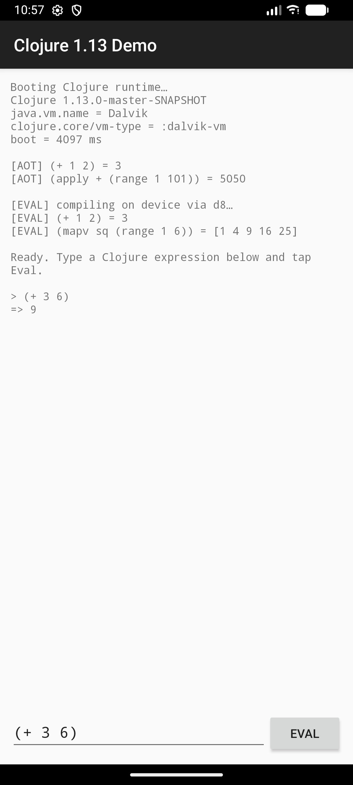

# clojure-android-demo

A minimal Android app that runs the **patched Clojure 1.13** (the
`DynamicClassLoader` hook + `RT.VM_TYPE` + Dalvik loader changes) on a device,
including on-device `eval` — JVM bytecode is translated to DEX at runtime by
`clojure.lang.DalvikDynamicClassLoader` (d8 + `InMemoryDexClassLoader`).



## What it shows

On launch (`MainActivity`):

- **AOT path** — calls bundled `clojure.core` functions directly, no compilation:
  `(+ 1 2)`, `(apply + (range 1 101))`.
- **`vm-type`** — prints `clojure.core/vm-type`, the Var added by the patch
  (`:dalvik-vm` on a device, `:java-vm` on the JVM).
- **Dynamic path** — `load-string` compiles fresh code and runs it through the
  Dalvik loader: `(+ 1 2)`, `(do (defn sq [x] (* x x)) (mapv sq (range 1 6)))`.
- A text box + **Eval** button = a tiny on-device REPL.

## Prerequisites / how it was built

1. Build the patched jar in the sibling Clojure repo:
   ```bash
   cd ../clojure && ./build-jar.sh
   ```
   It produces `clojure-1.13.0-master-SNAPSHOT.jar`, already copied here into
   `app/libs/` along with its two AOT-time deps (`spec.alpha`,
   `core.specs.alpha`).
2. `app/src/main/java/clojure/lang/DalvikDynamicClassLoader.java` is the d8 loader
   copied from `../clojure/android-support/` (it imports `android.*` / r8, so it
   lives in the app, not the main jar).

## Build & run

```bash
# Android SDK path is in local.properties (edit if yours differs).
./gradlew :app:assembleDebug              # build the APK
./gradlew :app:installDebug               # install on a connected device/emulator
# then launch "Clojure 1.13 Demo", or:
adb shell am start -n com.example.clojuredemo/.MainActivity
adb logcat -s ClojureDemo                 # watch the loader log
```

Or just open this folder in Android Studio and Run.

## Remote nREPL (Emacs CIDER)

`MyApp.onCreate` also starts a network **nREPL server on port 6688** (see
`MyApp.NREPL_PORT`). It boots on a background thread by `load-string`-ing
`(require 'nrepl.server)` + `nrepl.server/start-server` — i.e. nREPL's own `.clj`
sources are compiled on-device through the same d8 path as user eval. The
`nrepl:nrepl:1.0.0` dependency (clojure excluded) is in `app/build.gradle`, and
`INTERNET` permission is in the manifest.

Connect from Emacs:

```bash
./gradlew :app:installDebug
adb shell am start -n com.example.clojuredemo/.MainActivity   # launches → starts nREPL
adb logcat -s ClojureDemo                                     # wait for "nREPL server listening on 0.0.0.0:6688"
adb forward tcp:6688 tcp:6688                                 # tunnel device port to your machine
```

```
M-x cider-connect RET  Host: localhost RET  Port: 6688 RET
```

Notes:
- The server binds `0.0.0.0`, so you can also `cider-connect` straight to the
  device/emulator IP on a LAN; `adb forward` is the simplest/safest path.
- It's a **plain** nREPL (no `cider-nrepl` middleware) — eval/load works; some
  CIDER extras (completion, debugger) need cider-nrepl, which is heavy to compile
  on-device and left out on purpose.
- First connect is slow: requiring `nrepl.server` compiles all of nREPL via d8.
  Watch `logcat -s ClojureDemo`; start CIDER after the "listening" line.

## Versions / config

| | |
|---|---|
| AGP | 8.5.0 |
| Gradle | 8.11.1 |
| compileSdk / targetSdk | 34 |
| minSdk | **26** (d8 + `InMemoryDexClassLoader` requires API ≥ 26) |
| multiDex | enabled (Clojure + r8 exceed 64K methods) |
| minify | **off** (Clojure relies on runtime reflection) |
| on-device translator | `com.android.tools:r8:8.2.47` |

Verified on an API 36 emulator (see screenshot above): boot ≈ 4 s, both AOT
calls, and both on-device `eval`s succeed (`(+ 1 2) = 3`,
`(mapv sq (range 1 6)) = [1 4 9 16 25]`), plus interactive REPL input.

## Notes & gotchas

- **First boot takes a few seconds** — loading the AOT'd `clojure.core` and, for
  eval, running r8/d8 on the device. All Clojure work is on a background thread
  to avoid ANR.
- **`largeHeap="true"`** is set; Clojure's runtime is memory-hungry.
- The eval path bundles r8 (~MBs) into the APK so d8 can run on the device.
  Errors (if any) are shown in the output pane and logged to `logcat -s ClojureDemo`,
  not swallowed.
- **Two extra fixes** in the patched jar were needed for on-device eval (beyond
  the classloader patch), both in `../clojure`: a real `InputStream` path in
  `load-data-readers`, and a `Reflector.<clinit>` guard for Android's missing
  `AccessibleObject.canAccess`. Without them `RT` init / dynamic compilation crash
  on ART. See `../clojure/android-support/README.md`.
- `app/src/main/assets/data_readers.clj` is read by the patched
  `load-data-readers` via `DalvikDynamicClassLoader.getDataReadersStream()`.
- To use the **legacy dx** loader instead of d8, swap in
  `../clojure/android-support/DalvikDynamicClassLoader_dx_legacy.java.alt` and
  change the r8 dependency to `com.android.tools:dx:1.16`.
